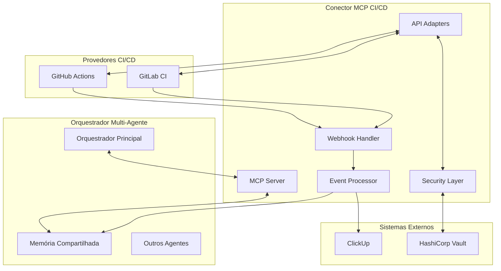

# Especificação Completa do Conector MCP CI/CD

## Visão Geral

Esta documentação especifica completamente o conector MCP (Model Context Protocol) para integração entre o orquestrador multi-agente e plataformas de CI/CD. O conector permite monitorar, acionar e coordenar operações de CI/CD mantendo estado compartilhado e gerando atualizações automáticas no ClickUp.

## Estrutura da Documentação

### 📋 [Especificação das Ferramentas MCP](./mcp-connectors/ci-cd-connector-spec.md)
Especificação detalhada das 5 ferramentas MCP principais:
- `query_execution_history` - Consulta histórico de execuções
- `get_pipeline_status` - Status detalhado de execuções
- `trigger_pipeline` - Acionamento seguro de pipelines
- `get_artifacts` - Listagem e download de artefatos
- `get_repository_config` - Configuração de repositórios

### 🗄️ [Schema de Dados na Memória Compartilhada](./shared-memory/ci-cd-data-schema.md)
Estruturas de dados para persistência de informações CI/CD:
- Estados de repositórios e execuções
- Métricas de performance e padrões de falha
- Rastreamento de deployments
- Baselines e regras de alerta

### 🔄 [Mapeamento de Eventos CI/CD → ClickUp](./event-mapping/ci-cd-to-clickup-events.md)
Regras automáticas para criação de tasks baseadas em eventos:
- Falhas de pipeline e falhas consecutivas críticas
- Deploys bem-sucedidos e falhas de deploy
- Detecção de testes flaky e regressões de performance
- Vulnerabilidades de segurança

### 🔒 [Arquitetura de Segurança](./security/ci-cd-connector-security.md)
Especificação completa de segurança:
- Gerenciamento de credenciais com HashiCorp Vault
- Controle de acesso baseado em papéis (RBAC)
- Auditoria e monitoramento de segurança
- Validação de webhooks e rate limiting

### 🏗️ [Arquitetura do Sistema](./architecture/ci-cd-connector-architecture.md)
Documentação arquitetural completa:
- Componentes principais e fluxos de dados
- Padrões de design (Adapter, Strategy, Observer)
- Estratégias de escalabilidade e performance
- Deployment e infraestrutura

### 🗓️ [Roadmap de Implementação](./roadmap/ci-cd-connector-roadmap.md)
Plano faseado de implementação:
- **MVP (6 semanas)**: Core MCP + GitHub Actions + ClickUp básico
- **Fase 2 (6 semanas)**: GitLab CI + Segurança avançada + Performance
- **Fase 3 (9 semanas)**: Multi-provider + Analytics + ML insights

## Resumo Executivo

### Objetivos Principais

1. **Monitoramento Unificado**: Interface única para GitHub Actions, GitLab CI e futuros provedores
2. **Automação Inteligente**: Criação automática de tasks no ClickUp baseada em eventos CI/CD
3. **Visibilidade Completa**: Estado centralizado na memória compartilhada para coordenação entre agentes
4. **Segurança Robusta**: Controle de acesso granular e auditoria completa

### Ferramentas MCP Principais

| Ferramenta | Descrição | Casos de Uso |
|------------|-----------|--------------|
| `query_execution_history` | Consulta histórico de execuções | Análise de tendências, debugging |
| `get_pipeline_status` | Status detalhado + logs | Monitoramento em tempo real |
| `trigger_pipeline` | Acionamento seguro | Deploys automatizados, testes |
| `get_artifacts` | Download de artefatos | Análise de builds, distribuição |
| `get_repository_config` | Configuração de repo | Descoberta de workflows |

### Eventos Automatizados

| Evento | Ação ClickUp | Prioridade | Assignee |
|--------|--------------|------------|----------|
| Pipeline falha | Task de bug fix | Alta | Repository owner |
| 3+ falhas consecutivas | Task crítica | Urgente | Tech lead + Owner |
| Deploy produção sucesso | Task de validação | Média | Deployer |
| Deploy falha | Task de incidente | Urgente | On-call engineer |
| Teste flaky detectado | Task de tech debt | Média | Test owner |
| Regressão performance | Task de otimização | Média | Performance team |
| Vulnerabilidade crítica | Task de segurança | Urgente | Security team |

### Arquitetura de Alto Nível

### Cronograma de Implementação

| Fase | Duração | Principais Entregáveis | Investimento |
|------|---------|------------------------|--------------|
| **MVP** | 6 semanas | Core MCP + GitHub + ClickUp básico | $120k |
| **Fase 2** | 6 semanas | GitLab + Segurança + Performance | $150k |
| **Fase 3** | 9 semanas | Multi-provider + Analytics + ML | $225k |
| **Total** | **21 semanas** | **Sistema completo** | **$495k** |

### Benefícios Esperados

#### Operacionais
- **80%** redução na criação manual de tasks
- **90%** detecção automática de falhas de pipeline
- **30%** redução no tempo de resposta a incidentes
- **25%** melhoria no MTTR (Mean Time To Recovery)

#### Técnicos
- Interface unificada para múltiplos provedores CI/CD
- Estado centralizado para coordenação entre agentes
- Segurança enterprise com auditoria completa
- Escalabilidade horizontal com microserviços

#### Estratégicos
- Base sólida para expansão futura (Jenkins, Azure DevOps)
- Framework extensível para novos tipos de evento
- Integração com sistema de monitoramento existente
- Compliance com requisitos de segurança corporativa

## Próximos Passos

### Ações Imediatas (Próximas 2 semanas)
1. **Aprovação da Especificação**: Review e aprovação desta documentação
2. **Setup do Projeto**: Criação de repositório e configuração de CI/CD
3. **Formação da Equipe**: Onboarding e training em MCP protocol
4. **Preparação da Infraestrutura**: Provisioning de Redis, PostgreSQL e Vault

### Marcos Críticos
- **Semana 2**: MVP Core Server pronto para testes
- **Semana 6**: MVP em produção com GitHub Actions
- **Semana 12**: Fase 2 completa com GitLab CI e segurança avançada
- **Semana 21**: Sistema completo entregue e operacional

### Critérios de Sucesso
- **Funcional**: 99%+ uptime, <2s response time, 95%+ task creation success
- **Negócio**: 80%+ automação de tasks, <10% false positives
- **Segurança**: 0 incidentes de segurança, 100% auditoria completa

---

Esta especificação serve como blueprint completo para implementação do conector MCP CI/CD, garantindo alinhamento entre todas as partes interessadas e fornecendo base sólida para execução do projeto.
