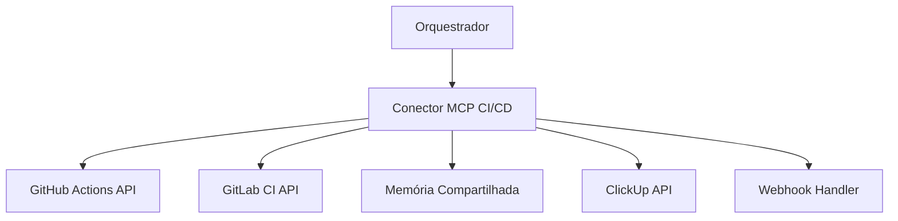

# Especificação do Conector MCP CI/CD

## Visão Geral

Este documento especifica o conector MCP (Model Context Protocol) para integração entre o orquestrador multi-agente e plataformas de CI/CD (GitHub Actions, GitLab CI, etc.). O conector permite monitorar, acionar e coordenar operações de CI/CD mantendo estado compartilhado e gerando atualizações apropriadas no ClickUp.

## Arquitetura do Conector

### Componentes Principais



### Responsabilidades

1. **Abstração de Plataforma**: Interface unificada para diferentes provedores de CI/CD
2. **Monitoramento**: Consulta contínua de status de pipelines e execuções
3. **Controle**: Acionamento seguro de pipelines com parâmetros
4. **Persistência**: Armazenamento de dados relevantes na memória compartilhada
5. **Eventos**: Processamento e propagação de eventos para ClickUp

## Especificação das Ferramentas MCP

### 1. query_execution_history

**Descrição**: Consulta o histórico de execuções de pipelines para um repositório/projeto.

**Parâmetros**:
```json
{
  "name": "query_execution_history",
  "description": "Consulta histórico de execuções de pipelines CI/CD",
  "inputSchema": {
    "type": "object",
    "properties": {
      "provider": {
        "type": "string",
        "enum": ["github", "gitlab"],
        "description": "Provedor de CI/CD"
      },
      "repository": {
        "type": "string",
        "description": "Nome do repositório (formato: owner/repo)"
      },
      "branch": {
        "type": "string",
        "description": "Branch específica (opcional)",
        "default": null
      },
      "status": {
        "type": "string",
        "enum": ["success", "failure", "pending", "cancelled", "all"],
        "description": "Filtro por status",
        "default": "all"
      },
      "limit": {
        "type": "integer",
        "description": "Número máximo de execuções",
        "default": 50,
        "minimum": 1,
        "maximum": 100
      },
      "since": {
        "type": "string",
        "format": "date-time",
        "description": "Data inicial para consulta (ISO 8601)"
      }
    },
    "required": ["provider", "repository"]
  }
}
```

**Resposta**:
```json
{
  "executions": [
    {
      "id": "string",
      "number": "integer",
      "status": "success|failure|pending|cancelled",
      "conclusion": "string",
      "workflow_name": "string",
      "branch": "string",
      "commit_sha": "string",
      "commit_message": "string",
      "author": "string",
      "created_at": "string (ISO 8601)",
      "updated_at": "string (ISO 8601)",
      "duration_seconds": "integer",
      "url": "string",
      "logs_url": "string",
      "artifacts_count": "integer"
    }
  ],
  "total_count": "integer",
  "has_more": "boolean"
}
```

### 2. get_pipeline_status

**Descrição**: Obtém status detalhado e logs de uma execução específica.

**Parâmetros**:
```json
{
  "name": "get_pipeline_status",
  "description": "Obtém status detalhado de uma execução de pipeline",
  "inputSchema": {
    "type": "object",
    "properties": {
      "provider": {
        "type": "string",
        "enum": ["github", "gitlab"],
        "description": "Provedor de CI/CD"
      },
      "repository": {
        "type": "string",
        "description": "Nome do repositório (formato: owner/repo)"
      },
      "execution_id": {
        "type": "string",
        "description": "ID da execução"
      },
      "include_logs": {
        "type": "boolean",
        "description": "Incluir logs detalhados",
        "default": false
      },
      "include_artifacts": {
        "type": "boolean",
        "description": "Incluir lista de artefatos",
        "default": false
      }
    },
    "required": ["provider", "repository", "execution_id"]
  }
}
```

**Resposta**:
```json
{
  "execution": {
    "id": "string",
    "status": "success|failure|pending|cancelled",
    "conclusion": "string",
    "workflow_name": "string",
    "branch": "string",
    "commit_sha": "string",
    "created_at": "string (ISO 8601)",
    "updated_at": "string (ISO 8601)",
    "duration_seconds": "integer",
    "url": "string"
  },
  "jobs": [
    {
      "id": "string",
      "name": "string",
      "status": "success|failure|pending|cancelled",
      "conclusion": "string",
      "started_at": "string (ISO 8601)",
      "completed_at": "string (ISO 8601)",
      "duration_seconds": "integer",
      "logs": "string (se include_logs=true)"
    }
  ],
  "artifacts": [
    {
      "id": "string",
      "name": "string",
      "size_bytes": "integer",
      "download_url": "string",
      "created_at": "string (ISO 8601)"
    }
  ]
}
```

### 3. trigger_pipeline

**Descrição**: Aciona uma execução de pipeline com parâmetros seguros.

**Parâmetros**:
```json
{
  "name": "trigger_pipeline",
  "description": "Aciona execução de pipeline CI/CD",
  "inputSchema": {
    "type": "object",
    "properties": {
      "provider": {
        "type": "string",
        "enum": ["github", "gitlab"],
        "description": "Provedor de CI/CD"
      },
      "repository": {
        "type": "string",
        "description": "Nome do repositório (formato: owner/repo)"
      },
      "workflow": {
        "type": "string",
        "description": "Nome ou ID do workflow/pipeline"
      },
      "branch": {
        "type": "string",
        "description": "Branch para execução",
        "default": "main"
      },
      "inputs": {
        "type": "object",
        "description": "Parâmetros de entrada para o workflow",
        "additionalProperties": true
      },
      "environment": {
        "type": "string",
        "description": "Ambiente de destino (dev, staging, prod)",
        "enum": ["dev", "staging", "prod"]
      }
    },
    "required": ["provider", "repository", "workflow"]
  }
}
```

**Resposta**:
```json
{
  "execution": {
    "id": "string",
    "number": "integer",
    "status": "pending",
    "workflow_name": "string",
    "branch": "string",
    "url": "string",
    "created_at": "string (ISO 8601)"
  },
  "message": "Pipeline acionado com sucesso"
}
```

### 4. get_artifacts

**Descrição**: Lista e permite download de artefatos de uma execução.

**Parâmetros**:
```json
{
  "name": "get_artifacts",
  "description": "Lista artefatos de uma execução de pipeline",
  "inputSchema": {
    "type": "object",
    "properties": {
      "provider": {
        "type": "string",
        "enum": ["github", "gitlab"],
        "description": "Provedor de CI/CD"
      },
      "repository": {
        "type": "string",
        "description": "Nome do repositório (formato: owner/repo)"
      },
      "execution_id": {
        "type": "string",
        "description": "ID da execução"
      },
      "artifact_name": {
        "type": "string",
        "description": "Nome específico do artefato (opcional)"
      }
    },
    "required": ["provider", "repository", "execution_id"]
  }
}
```

**Resposta**:
```json
{
  "artifacts": [
    {
      "id": "string",
      "name": "string",
      "size_bytes": "integer",
      "download_url": "string",
      "created_at": "string (ISO 8601)",
      "expires_at": "string (ISO 8601)"
    }
  ],
  "total_count": "integer"
}
```

### 5. get_repository_config

**Descrição**: Obtém configuração de CI/CD de um repositório.

**Parâmetros**:
```json
{
  "name": "get_repository_config",
  "description": "Obtém configuração de CI/CD do repositório",
  "inputSchema": {
    "type": "object",
    "properties": {
      "provider": {
        "type": "string",
        "enum": ["github", "gitlab"],
        "description": "Provedor de CI/CD"
      },
      "repository": {
        "type": "string",
        "description": "Nome do repositório (formato: owner/repo)"
      }
    },
    "required": ["provider", "repository"]
  }
}
```

**Resposta**:
```json
{
  "workflows": [
    {
      "id": "string",
      "name": "string",
      "path": "string",
      "state": "active|disabled",
      "triggers": ["push", "pull_request", "schedule"],
      "environments": ["dev", "staging", "prod"]
    }
  ],
  "environments": [
    {
      "name": "string",
      "protection_rules": ["required_reviewers", "wait_timer"],
      "secrets_count": "integer"
    }
  ],
  "default_branch": "string"
}
```

## Tratamento de Erros

### Códigos de Erro Padrão

```json
{
  "error": {
    "code": -32000,
    "message": "Provider authentication failed",
    "data": {
      "provider": "github",
      "details": "Invalid or expired token"
    }
  }
}
```

### Códigos Específicos

- `-32000`: Erro de autenticação
- `-32001`: Repositório não encontrado
- `-32002`: Workflow/Pipeline não encontrado
- `-32003`: Permissões insuficientes
- `-32004`: Rate limit excedido
- `-32005`: Erro de rede/timeout
- `-32006`: Parâmetros inválidos

## Configuração de Segurança

### Autenticação

```json
{
  "providers": {
    "github": {
      "auth_type": "token",
      "token_env": "GITHUB_TOKEN",
      "scopes": ["repo", "actions"]
    },
    "gitlab": {
      "auth_type": "token",
      "token_env": "GITLAB_TOKEN",
      "scopes": ["api", "read_repository"]
    }
  }
}
```

### Controle de Acesso

- Validação de permissões antes de acionamento
- Whitelist de repositórios permitidos
- Controle de ambientes por nível de acesso
- Auditoria de todas as operações

## Integração com Memória Compartilhada

### Estrutura de Dados Persistidos

```json
{
  "ci_cd_state": {
    "repositories": {
      "owner/repo": {
        "last_execution": {
          "id": "string",
          "status": "string",
          "timestamp": "string"
        },
        "failure_patterns": [
          {
            "workflow": "string",
            "error_pattern": "string",
            "occurrences": "integer",
            "last_seen": "string"
          }
        ],
        "performance_metrics": {
          "avg_duration_seconds": "integer",
          "success_rate": "float",
          "last_updated": "string"
        }
      }
    }
  }
}
```

### Políticas de Atualização

- Execuções: Atualização em tempo real via webhooks
- Métricas: Agregação diária
- Padrões de falha: Análise semanal
- Limpeza: Dados > 90 dias removidos

## Próximos Passos

1. Implementação do adaptador GitHub Actions
2. Implementação do adaptador GitLab CI
3. Sistema de webhooks para eventos em tempo real
4. Dashboard de monitoramento
5. Alertas inteligentes baseados em padrões
